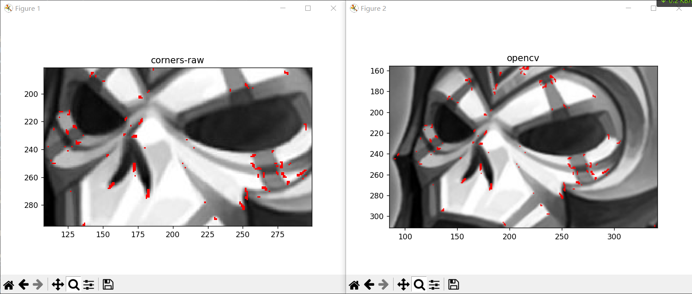

# 哈里斯兴趣点算子

角点是图像中突出的、在不同方向上都有较大灰度变化的点。在具体实现上，该算法通过计算每个像素点周围的灰度变化来判断该点是否为角点，从而实现角点的检测。

> 求矩阵的全部特征值和特征向量的方法如下：
>
> 1. 计算的特征多项式；
> 2. 求出特征方程的全部根，即为的全部特征值；
> 3. 对于的每一个特征值，求出齐次线性方程组的一个基础解系，则可求出属于特征值的全部。

## 1. 实现过程

### 1.1 Harris算子的具体实现步骤如下：

1. 计算图像中每个像素点的梯度（可以使用Sobel算子等方法）。
2. 对于每个像素点，计算其周围像素的灰度变化的协方差矩阵。
3. 计算协方差矩阵的特征值，通过特征值的大小来判断该点是否为角点。如果特征值较大，则说明该点周围存在大量的灰度变化，可能是角点。

通过这种方法，可以比较准确地检测出图像中的角点，该算法被广泛应用于计算机视觉领域中的特征提取、目标跟踪等任务中。

### 1.2 Harris 角点检测算法分为以下三步：

1. 当窗口同时向 `x` 和 `y` 两个方向移动时，计算窗口内部的像素值变化量`E(u,v)`；
2. 对于每个窗口，都计算其对应的一个角点响应函数`R`；
3. 然后对该函数进行阈值处理，如果`R > threshold`，表示该窗口对应一个角点特征。

## 2. 算法实现 [Harris.py](Harris.py)

> 参考：[https://blog.csdn.net/xiaohuolong1827/article/details/125559091](https://blog.csdn.net/xiaohuolong1827/article/details/125559091)

### 2.1 OpenCV 库 cv2.boxFilter() 函数

- `cv2.boxFilter()`是OpenCV中用于平滑滤波的函数之一。
- 该函数可以在一个矩形区域内对像素进行加权平均，从而产生一个输出像素值。这个矩形区域被称为卷积核或窗口。
- `boxFilter()`函数使用窗口内的像素值进行加权平均，产生一个新的像素值，以此来平滑图像。
- `boxFilter()`函数的输入参数包括图像、输出图像深度、卷积核大小、卷积核锚点和标准化选项等。

具体来说，函数的输入参数包括：

| 参数名    | 含义 / 作用                                                  |
| :-------- | ------------------------------------------------------------ |
| src       | 输入的图像                                                   |
| ddepth    | 输出图像的深度，如果为`-1`，输出图像将具有与输入图像相同的深度 |
| ksize     | 卷积核的大小。如果是`（a，b）`，则表示卷积核是一个`a`行b列的矩阵。如果`ksize`为`-1`，则表示卷积核大小与锚点大小相同 |
| anchor    | 卷积核锚点的位置。如果为`（-1，-1）`，则表示卷积核锚点位于卷积核的中心 |
| normalize | 是否标准化卷积核。如果为`True`，则卷积核内的所有像素值将被除以卷积核内所有像素值的总和 |

- `boxFilter()`函数的输出是平滑后的图像。平滑后的像素值是由窗口内的像素值进行加权平均得到的。加权平均的权重由卷积核内的像素值决定。
- `boxFilter()`函数常用于图像平滑处理，可以用来去除图像中的噪声和细节，也可以用来检测边缘和角点等。

### 2.2 核心代码

定义一个Harris角点检测器函数，使用Sobel算子计算图像中每个像素的水平和垂直梯度，然后计算梯度矩阵的行列式和迹，以确定每个像素是否是角点。该函数的输入是一个图像，它会被转换为浮点数类型。其他参数包括块大小、孔径大小、k值和边界类型等。

函数首先将图像转换为浮点数类型，然后对每个像素计算`Ix`和`Iy`，分别代表水平和垂直梯度。接下来，计算`Ix`和`Iy`的平方和，以及`Ix`和`Iy`的乘积。使用`cv2.boxFilter`函数计算每个像素的响应值。最后返回一个包含每个像素的响应值的数组。

- 注意：
- 下述代码中， `block_size=3` 。在 Harris 角点检测算法中，需要对每个像素周围的邻域进行处理，以计算其角点响应值。通常使用一个小的矩形窗口来对邻域进行处理，这个窗口被称为局部窗口，其大小通常称为块大小`（block_size）`。块大小越大，那么对于同一个像素，所考虑的邻域就越大，处理出来的响应值就会更加平滑，这会导致角点的定位不够准确。而块大小越小，那么考虑的邻域就越小，处理出来的响应值就会更加敏感，这样会使角点的定位更加准确，但也会使检测出的角点数量减少。
- 块大小为3时，使用`cv2.boxFilter()`函数对邻域进行求和操作，计算出每个像素点的响应值。相对于块大小为2，块大小为3时考虑的邻域更大（确切来说我们无法想象为2的块是什么形态），能够更好地捕获到局部特征信息，从而使检测结果更加准确。但是块大小过大也会使算法的运行时间变慢，因此需要在准确性和运行时间之间进行权衡和选择。

```python
def harris_corner_detect(img_src, block_size=3, aperture_size=3, k=0.04, borderType=cv2.BORDER_DEFAULT):
    if img_src.dtype != np.uint8:
        raise ("input image shoud be uint8 type")
    R_arr = np.zeros(img_src.shape, dtype=np.float32)  # 用来存储角点响应值
    img = img_src.astype(np.float32)
    scale = 1.0 / ((aperture_size - 1) * 2 * block_size * 255)  # 参考opencv实现源码，在sobel算子时乘以这个系数
    # 借助sobel算子，计算x、y方向上的偏导数
    Ix = cv2.Sobel(img, -1, dx=1, dy=0, ksize=aperture_size, scale=scale, borderType=borderType)
    Iy = cv2.Sobel(img, -1, dx=0, dy=1, ksize=aperture_size, scale=scale, borderType=borderType)
    Ixx = Ix ** 2
    Iyy = Iy ** 2
    Ixy = Ix * Iy
    # 借助boxFilter函数，以block_size为窗口大小，对窗口内的数值求和，且不归一化
    f_xx = cv2.boxFilter(Ixx, ddepth=-1, ksize=(block_size, block_size), anchor=(-1, -1), normalize=False,
                         borderType=borderType)
    f_yy = cv2.boxFilter(Iyy, ddepth=-1, ksize=(block_size, block_size), anchor=(-1, -1), normalize=False,
                         borderType=borderType)
    f_xy = cv2.boxFilter(Ixy, ddepth=-1, ksize=(block_size, block_size), anchor=(-1, -1), normalize=False,
                         borderType=borderType)
    # 也可以尝试手动求和
    radius = int((block_size - 1) / 2)  # 考虑blocksize为偶数的情况，奇数时，前、后的数量一样；为偶数时，后比前多一个
    N_pre = radius
    N_post = block_size - N_pre - 1
    row_s, col_s = N_pre, N_pre
    row_e, col_e = img.shape[0] - N_post, img.shape[1] - N_post
    # 开始计算每一个坐标下的响应值
    for r in range(row_s, row_e):
        for c in range(col_s, col_e):
            # 手动对窗口内的数值求和
            # sum_xx = Ixx[r-N_pre:r+N_post+1,c-N_pre:c+N_post+1].sum()
            # sum_yy = Iyy[r-N_pre:r+N_post+1,c-N_pre:c+N_post+1].sum()
            # sum_xy = Ixy[r-N_pre:r+N_post+1,c-N_pre:c+N_post+1].sum()
            # 或者直接使用boxFilter的结果
            sum_xx = f_xx[r, c]
            sum_yy = f_yy[r, c]
            sum_xy = f_xy[r, c]
            # 根据行列式和迹求响应值
            det = (sum_xx * sum_yy) - (sum_xy ** 2)
            trace = sum_xx + sum_yy
            res = det - k * (trace ** 2)
            # 或者用如下方式求行列式和迹
            # M = np.array([[sum_xx,sum_xy],[sum_xy,sum_yy]])
            # res = np.linalg.det(M) - (k *  (np.trace(M))**2 )
            R_arr[r, c] = res
    return R_arr
```

### 3. 测试用例


### 4. 输出结果


