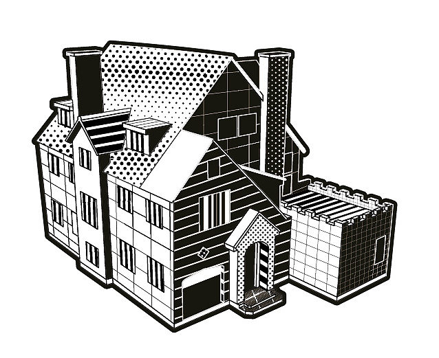
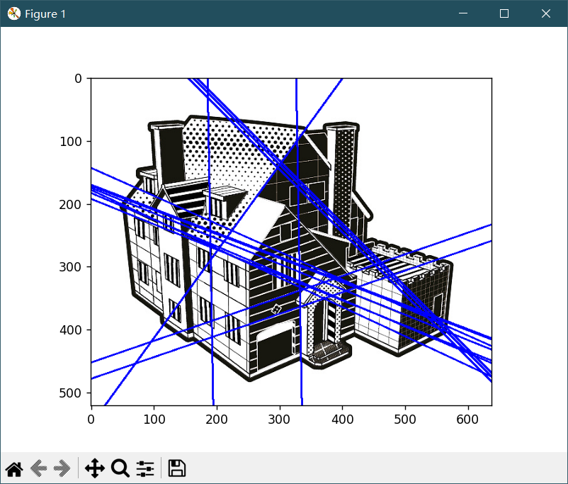
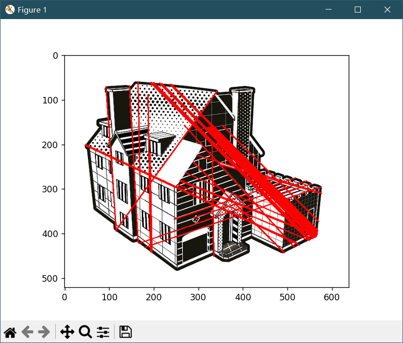
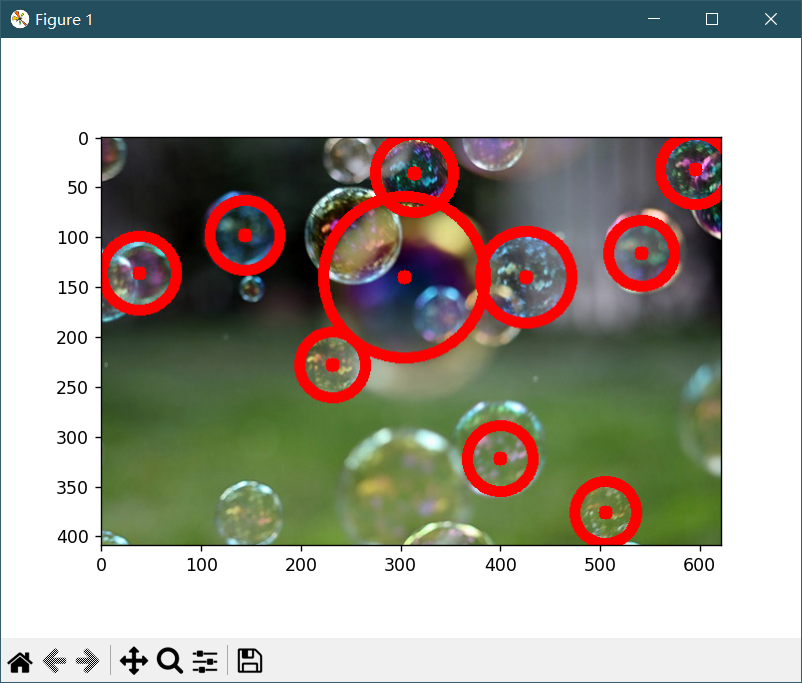

# 哈夫变换

哈夫变换（Hough transform）是一种用于图像处理和计算机视觉的技术，主要用于检测图像中的直线和其他形状。

哈夫变换也称之为霍夫变换。

## 1. 概述

在哈夫变换中，图像中的每个像素都被视为一条直线，从而使图像中的每个直线都可以表示为由该直线上的点组成的集合。哈夫变换算法将图像中的所有直线转换为Hough空间中的曲线，其中每个点表示一条直线。在Hough空间中，直线的极坐标方程（也称为霍夫参数）被表示为一个点。这些点的位置和数量可以用来检测图像中的直线和其他形状。

## 2. 直线检测

### 2.1 OpenCV - HoughLines() 函数

OpenCV 提供了函数 `cv2.HoughLines()` 用来实现霍夫直线变换，该函数要求所操作的源图像是一个二值图像，所以在进行霍夫变换之前要先将源图像进行二值化，或者进行 Canny 边缘检测。

函数 `cv2.HoughLines()` 的语法格式为：

```python
lines = cv2.HoughLines(image, rho, theta, threshold)
```

其中：

| 参数名    | 含义 / 作用                                                  |
| :-------- | :----------------------------------------------------------- |
| image     | 是输入图像，即源图像，必须是 **8位的单通道二值图像**         |
| rho       | 以**像素**为单位的距离`r`的精度。一般情况下，使用的精度是`1` |
| theta     | 角度`θ`的精度。一般情况下，使用的精度是 `π/180`，表示要搜索所有可能的角度 |
| threshold | 阈值，该值越小，判定出的直线就越多                           |
| lines     | 返回值， 每个元素都是一对**浮点数**， 表示检测到的直线的参数， 即`(r, θ)` ， 是`numpy.ndarray`类型。 |

值得注意的是：

1. 算法上所认为的直线其实是一个**很窄很长**的矩形，至于认为多窄以内的是直线，由阈值 `threshold` 决定。
2. 使用函数 `cv2.HoughLines()` 检测到的是图像中的直线而不是线段，因此检测到的直线是没有端点的。所以，在进行霍夫直线变换时所绘制的直线都是穿过整幅图像的。

### 2.2 初次代码实现 [line/HoughL.py](line/HoughL.py)

- **调用 cv2.HoughLines 函数查找图片中所有的直线**

    ```python
    Path = '../../../img/house.png'
    img = cv2.imread(Path)
    gray_img = cv2.cvtColor(img, cv2.COLOR_BGR2GRAY)
    edges = cv2.Canny(gray_img, 50, 150, apertureSize=3)
    lines = cv2.HoughLines(edges, 1, np.pi / 180, 180)
    rgb_img = cv2.cvtColor(img, cv2.COLOR_BGR2RGB)
    print(lines)
    ```
    
    其中，阈值设置为180，我们找到了一些明显的直线，可以通过调整阈值控制找到的直线数量
    
- **接下来，遍历结果并逐一显示在图片中**

    ```python
    new_img = rgb_img.copy()
    for line in lines:
        rho, theta = line[0]
        a = np.cos(theta)
        b = np.sin(theta)
        x0 = a * rho
        y0 = b * rho
        x1 = int(x0 + 1000 * (-b))
        y1 = int(y0 + 1000 * (a))
        x2 = int(x0 - 1000 * (-b))
        y2 = int(y0 - 1000 * (a))
        cv2.line(new_img, (x1, y1), (x2, y2), (0, 0, 255), 2)
    plt.imshow(new_img)
    plt.show()
    ```

    需要注意的是，如果阈值设置过高，会导致找不到任何直线，此时程序会报错并退出

- **测试用例**

    

- **输出结果**

    

- **注意事项**

    如图，我们看似成功的运行了程序，但事实上，运行该程序所使用的测试用例是一个直线特征显著且简单的图像，如果换做一般图像，往往会得到满屏直线（即不可使用的运行结果），如课件中所示：

    

    即使可以通过调整阈值来改善这个现象，但是面对复杂图像的结果往往会很差（因为找的是直线，不是线段），因此，我们需要采取其他手段来进行优化。

### 2.3 OpenCV - HoughLinesP() 函数

在OpenCV中通过`cv2.HoughLinesP()`函数实现概率霍夫变换。

该函数的语法格式为：

```python
lines = cv2.HoughLinesP(image, rho, theta, threshold, minLineLength=x, maxLineGap=y)
```

其中：

| 参数名              | 含义 / 作用                                                  |
| :------------------ | :----------------------------------------------------------- |
| image               | 输入图像，即原图像，必须为**8位的单通道二值图像**            |
| rho                 | 以**像素**为单位的距离`r`的精度。一般情况下，使用的精度是`1` |
| theta               | 角度θ的精度。一般情况下，使用的精度是 `np.pi/180`，表示要搜索可能的角度 |
| threshold           | 阈值。该值**越小**，判定出的直线**越多**；值**越大**，判定出的直线就**越少** |
| x `(minLineLength)` | 用来控制 “**接受直线的最小长度**” 的值，默认值为`0`          |
| y `(maxLineGap)`    | 用来控制接受共线线段之间的最小间隔，即在一条线中两点的最大间隔，默认值为`0` |
| lines               | 返回值。是由 `numpy.ndarray` 类型的元素构成的，其中每个元素都是一对浮点数，表示检测到的直线的参数 |

注意：如果两点间的间隔超过了参数 `maxLineGap` 的值，就认为这两点不在一条线上。

### 2.4 优化 - 使用概率霍夫变换算法 [line/HoughP.py](line/HoughP.py)

- **为更好地判断直线，概率霍夫变换算法对选取直线的方法作了两点改进：**

  - 所接受直线的**最小长度**。如果有超过阈值个数的像素点构成了一条直线，但是这条直线很短，那么就不会接受该直线作为判断结果，而认为这条直线仅仅是图像中的若干个像素点恰好随机构成了一种算法上的直线关系而已，实际上原图中并不存在这条直线。
  - 接受直线时允许的**最大像素点间距**。如果有超过阈值个数的像素点构成了一条直线，但是这组像素点之间的距离都很远，就不会接受该直线作为判断结果，而认为这条直线仅仅是图像中的若干个像素点恰好随机构成了一种算法上的直线关系而已，实际上原始图像中并不存在这条直线。

- **调用 cv2.HoughLinesP 函数查找图片中所有的直线**

  ```python
  Path = '../../../img/house.png'
  img = cv2.imread(Path)
  grey_img = cv2.cvtColor(img, cv2.COLOR_BGR2GRAY)
  rgb_img = cv2.cvtColor(img, cv2.COLOR_BGR2RGB)
  edges = cv2.Canny(grey_img, 150, 200, apertureSize=3)
  lines = cv2.HoughLinesP(edges, 1, np.pi / 180, 150, minLineLength=200, maxLineGap=20)
  ```

- **类似的，遍历并打印**

  ```python
  new_img = rgb_img.copy()
  for line in lines:
      x1, y1, x2, y2 = line[0]
      cv2.line(new_img, (x1, y1), (x2, y2), (255, 0, 0), 2)
  plt.imshow(new_img)
  plt.show()
  ```

- **测试用例**

  

- **输出结果**

  

## 3. 椭圆检测

- 哈夫变换可用来检测各种能以解析式 `f(x, c) = 0` 表示的曲线或目标轮廓，其中，`x`为图像点坐标的矢量，`c`为参数矢量。
- 实际上，只要是能够用一个**参数方程**表示的对象，都适合用霍夫变换来检测。
- 用霍夫圆变换来检测图像中的圆，与使用霍夫直线变换检测直线的原理类似。在霍夫圆变换中，需要考虑**圆半径**和**圆心**（x坐标、y坐标）共3个参数。
- 在OpenCV中，采用的策略是两轮筛选。第1轮筛选找出可能存在圆的位置（**圆心**）；第2轮再根据第1轮的结果筛选出**半径**大小。
- 需要特别注意，在调用函数 `cv2.HoughLinesCircles()` 之前，要对源图像进行**平滑操作**，以减少图像中的噪声，避免发生误判。

### 3.1 OpenCV - cv2.HoughCircles() 函数

OpenCV中，通过函数`cv2.HoughCircles()`实现霍夫圆变换，该函数将Canny边缘检测和霍夫变换结合。

该函数的语法格式为：

```python
circles = cv2.HoughCircles(image, method, dp, minDist, param1, param2, minRadius, maxradius)
```

其中：

| 参数名    | 含义 / 作用                                                  |
| :-------- | :----------------------------------------------------------- |
| image     | 输入图像，即源图像，类型为8位的单通道灰度图像                |
| method    | 检测方法。该参数代表的是霍夫圆检测中两轮检测所使用的方法     |
| dp        | 累计器分辨率，它是一个分割比率，用来指定图像分辨率与圆心累加器分辨率的比例 |
| minDist   | 圆心间的最小间距，该值被作为阈值使用                         |
| param1    | 该参数是缺省的，在缺省时默认值为`100`，它对应的是 Canny边缘检测器 的高阈值 |
| param2    | 圆心位置必须收到的投票数。该值**越大**，检测到的圆**越少**；该值**越小**，检测到的圆**越多**；缺省默认值为`100` |
| minRadius | 圆半径的**最小值**，小于该值的圆不会被检测出来，缺省默认值为`0` |
| maxRadius | 圆半径的**最大值**，大于该值的圆不会被检测出来，缺省默认值为`0` |
| circles   | 返回值，由**圆心坐标**和**半径**构成的`numpy.ndarray`        |

值得注意的是：

1. 累计器分辨率`dp`，它是一个分割比率，用来指定图像分辨率与圆心累加器分辨率的比例。如果dp=1，则输入图像和累加器具有相同的分辨率。
2. `minDist `被作为阈值使用，如果存在圆心间距离小于该值的多个圆，则仅有一个会被检测出来。因此，如果该值太小，则会有多个临近的圆被检测出来；如果该值太大，则可能会在检测时漏掉一些圆。
3. Canny边缘检测器的低阈值是高阈值的二分之一。
4. 投票数的作用：只有在第1轮筛选过程中，投票数超过该值的圆，才进入第2轮的筛选。
5. `minRadius` 和 `maxRadius` 该参数缺省时具有默认值0，此时该参数不起作用。

### 3.2 直接调用代码实现 [circle/HoughCircleTest.py](circle/HoughCircleTest.py)

```python
img = cv2.imread(Path)
gray_img = cv2.cvtColor(img, cv2.COLOR_BGR2GRAY)
rgb_img = cv2.cvtColor(img, cv2.COLOR_BGR2RGB)
new_img = rgb_img.copy()
circles = cv2.HoughCircles(gray_img, cv2.HOUGH_GRADIENT, 1, 100, param1=100, param2=30, minRadius=20, maxRadius=90)
print(circles)
```

我们直接通过调用OpenCV提供的函数实现了圆的检测，由课件上的样例我们可以得知运行结果比较不理想，所以在此选择了一张富含圆比较多的图片，再进行调参，得到了比较可观的结果，但仍有识别异常的情况（此异常为正常现象）。

- **测试用例**

  

- **输出结果**

  

### 3.3 一般代码实现
