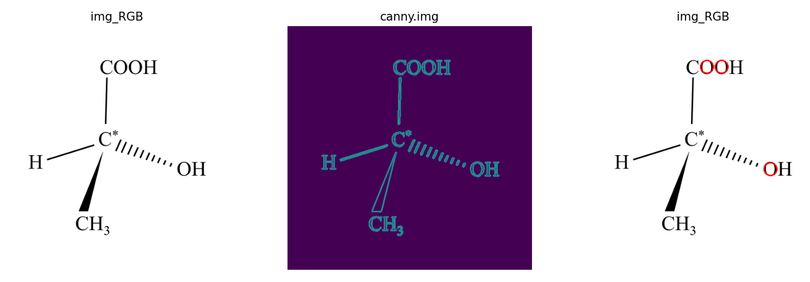

# 哈夫变换

哈夫变换（Hough transform）是一种用于图像处理和计算机视觉的技术，主要用于检测图像中的直线和其他形状。

哈夫变换也称之为霍夫变换。

## 1. 概述

在哈夫变换中，图像中的每个像素都被视为一条直线，从而使图像中的每个直线都可以表示为由该直线上的点组成的集合。哈夫变换算法将图像中的所有直线转换为Hough空间中的曲线，其中每个点表示一条直线。在Hough空间中，直线的极坐标方程（也称为霍夫参数）被表示为一个点。这些点的位置和数量可以用来检测图像中的直线和其他形状。

## 2. 直线检测

### 2.1 OpenCV - HoughLines() 函数

OpenCV 提供了函数 `cv2.HoughLines()` 用来实现霍夫直线变换，该函数要求所操作的源图像是一个二值图像，所以在进行霍夫变换之前要先将源图像进行二值化，或者进行 Canny 边缘检测。

函数 `cv2.HoughLines()` 的语法格式为：

```python
lines = cv2.HoughLines(image, rho, theta, threshold)
```

其中：

| 参数名    | 含义 / 作用                                                  |
| :-------- | :----------------------------------------------------------- |
| image     | 是输入图像，即源图像，必须是 **8位的单通道二值图像**         |
| rho       | 以**像素**为单位的距离`r`的精度。一般情况下，使用的精度是`1` |
| theta     | 角度`θ`的精度。一般情况下，使用的精度是 `π/180`，表示要搜索所有可能的角度 |
| threshold | 阈值，该值越小，判定出的直线就越多                           |
| lines     | 返回值， 每个元素都是一对**浮点数**， 表示检测到的直线的参数， 即`(r, θ)` ， 是`numpy.ndarray`类型。 |

值得注意的是：

1. 算法上所认为的直线其实是一个**很窄很长**的矩形，至于认为多窄以内的是直线，由阈值 `threshold` 决定。
2. 使用函数 `cv2.HoughLines()` 检测到的是图像中的直线而不是线段，因此检测到的直线是没有端点的。所以，在进行霍夫直线变换时所绘制的直线都是穿过整幅图像的。

### 2.2 初次代码实现 [line/HoughL.py](line/HoughL.py)

- **调用 cv2.HoughLines 函数查找图片中所有的直线**

    ```python
    Path = '../../../img/house.png'
    img = cv2.imread(Path)
    gray_img = cv2.cvtColor(img, cv2.COLOR_BGR2GRAY)
    edges = cv2.Canny(gray_img, 50, 150, apertureSize=3)
    lines = cv2.HoughLines(edges, 1, np.pi / 180, 180)
    rgb_img = cv2.cvtColor(img, cv2.COLOR_BGR2RGB)
    print(lines)
    ```
    
    其中，阈值设置为180，我们找到了一些明显的直线，可以通过调整阈值控制找到的直线数量
    
- **接下来，遍历结果并逐一显示在图片中**

    ```python
    new_img = rgb_img.copy()
    for line in lines:
        rho, theta = line[0]
        a = np.cos(theta)
        b = np.sin(theta)
        x0 = a * rho
        y0 = b * rho
        x1 = int(x0 + 1000 * (-b))
        y1 = int(y0 + 1000 * (a))
        x2 = int(x0 - 1000 * (-b))
        y2 = int(y0 - 1000 * (a))
        cv2.line(new_img, (x1, y1), (x2, y2), (0, 0, 255), 2)
    plt.imshow(new_img)
    plt.show()
    ```

    需要注意的是，如果阈值设置过高，会导致找不到任何直线，此时程序会报错并退出

- **测试用例**

    

- **输出结果**

    

- **注意事项**

    如图，我们看似成功的运行了程序，但事实上，运行该程序所使用的测试用例是一个直线特征显著且简单的图像，如果换做一般图像，往往会得到满屏直线（即不可使用的运行结果），如课件中所示：

    

    即使可以通过调整阈值来改善这个现象，但是面对复杂图像的结果往往会很差（因为找的是直线，不是线段），因此，我们需要采取其他手段来进行优化。

### 2.3 OpenCV - HoughLinesP() 函数

在OpenCV中通过`cv2.HoughLinesP()`函数实现概率霍夫变换。

该函数的语法格式为：

```python
lines = cv2.HoughLinesP(image, rho, theta, threshold, minLineLength=x, maxLineGap=y)
```

其中：

| 参数名              | 含义 / 作用                                                  |
| :------------------ | :----------------------------------------------------------- |
| image               | 输入图像，即原图像，必须为**8位的单通道二值图像**            |
| rho                 | 以**像素**为单位的距离`r`的精度。一般情况下，使用的精度是`1` |
| theta               | 角度θ的精度。一般情况下，使用的精度是 `np.pi/180`，表示要搜索可能的角度 |
| threshold           | 阈值。该值**越小**，判定出的直线**越多**；值**越大**，判定出的直线就**越少** |
| x `(minLineLength)` | 用来控制 “**接受直线的最小长度**” 的值，默认值为`0`          |
| y `(maxLineGap)`    | 用来控制接受共线线段之间的最小间隔，即在一条线中两点的最大间隔，默认值为`0` |
| lines               | 返回值。是由 `numpy.ndarray` 类型的元素构成的，其中每个元素都是一对浮点数，表示检测到的直线的参数 |

注意：如果两点间的间隔超过了参数 `maxLineGap` 的值，就认为这两点不在一条线上。

### 2.4 优化 - 使用概率霍夫变换算法 [line/HoughP.py](line/HoughP.py)

- **为更好地判断直线，概率霍夫变换算法对选取直线的方法作了两点改进：**

  - 所接受直线的**最小长度**。如果有超过阈值个数的像素点构成了一条直线，但是这条直线很短，那么就不会接受该直线作为判断结果，而认为这条直线仅仅是图像中的若干个像素点恰好随机构成了一种算法上的直线关系而已，实际上原图中并不存在这条直线。
  - 接受直线时允许的**最大像素点间距**。如果有超过阈值个数的像素点构成了一条直线，但是这组像素点之间的距离都很远，就不会接受该直线作为判断结果，而认为这条直线仅仅是图像中的若干个像素点恰好随机构成了一种算法上的直线关系而已，实际上原始图像中并不存在这条直线。

- **调用 cv2.HoughLinesP 函数查找图片中所有的直线**

  ```python
  Path = '../../../img/house.png'
  img = cv2.imread(Path)
  grey_img = cv2.cvtColor(img, cv2.COLOR_BGR2GRAY)
  rgb_img = cv2.cvtColor(img, cv2.COLOR_BGR2RGB)
  edges = cv2.Canny(grey_img, 150, 200, apertureSize=3)
  lines = cv2.HoughLinesP(edges, 1, np.pi / 180, 150, minLineLength=200, maxLineGap=20)
  ```

- **类似的，遍历并打印**

  ```python
  new_img = rgb_img.copy()
  for line in lines:
      x1, y1, x2, y2 = line[0]
      cv2.line(new_img, (x1, y1), (x2, y2), (255, 0, 0), 2)
  plt.imshow(new_img)
  plt.show()
  ```

- **测试用例**

  

- **输出结果**

  

## 3. 椭圆检测

- 哈夫变换可用来检测各种能以解析式 `f(x, c) = 0` 表示的曲线或目标轮廓，其中，`x`为图像点坐标的矢量，`c`为参数矢量。
- 实际上，只要是能够用一个**参数方程**表示的对象，都适合用霍夫变换来检测。
- 用霍夫圆变换来检测图像中的圆，与使用霍夫直线变换检测直线的原理类似。在霍夫圆变换中，需要考虑**圆半径**和**圆心**（x坐标、y坐标）共3个参数。
- 在OpenCV中，采用的策略是两轮筛选。第1轮筛选找出可能存在圆的位置（**圆心**）；第2轮再根据第1轮的结果筛选出**半径**大小。
- 需要特别注意，在调用函数 `cv2.HoughLinesCircles()` 之前，要对源图像进行**平滑操作**，以减少图像中的噪声，避免发生误判。

### 3.1 OpenCV - cv2.HoughCircles() 函数

OpenCV中，通过函数`cv2.HoughCircles()`实现霍夫圆变换，该函数将Canny边缘检测和霍夫变换结合。

该函数的语法格式为：

```python
circles = cv2.HoughCircles(image, method, dp, minDist, param1, param2, minRadius, maxradius)
```

其中：

| 参数名    | 含义 / 作用                                                  |
| :-------- | :----------------------------------------------------------- |
| image     | 输入图像，即源图像，类型为8位的单通道灰度图像                |
| method    | 检测方法。该参数代表的是霍夫圆检测中两轮检测所使用的方法     |
| dp        | 累计器分辨率，它是一个分割比率，用来指定图像分辨率与圆心累加器分辨率的比例 |
| minDist   | 圆心间的最小间距，该值被作为阈值使用                         |
| param1    | 该参数是缺省的，在缺省时默认值为`100`，它对应的是 Canny边缘检测器 的高阈值 |
| param2    | 圆心位置必须收到的投票数。该值**越大**，检测到的圆**越少**；该值**越小**，检测到的圆**越多**；缺省默认值为`100` |
| minRadius | 圆半径的**最小值**，小于该值的圆不会被检测出来，缺省默认值为`0` |
| maxRadius | 圆半径的**最大值**，大于该值的圆不会被检测出来，缺省默认值为`0` |
| circles   | 返回值，由**圆心坐标**和**半径**构成的`numpy.ndarray`        |

值得注意的是：

1. 累计器分辨率`dp`，它是一个分割比率，用来指定图像分辨率与圆心累加器分辨率的比例。如果dp=1，则输入图像和累加器具有相同的分辨率。
2. `minDist `被作为阈值使用，如果存在圆心间距离小于该值的多个圆，则仅有一个会被检测出来。因此，如果该值太小，则会有多个临近的圆被检测出来；如果该值太大，则可能会在检测时漏掉一些圆。
3. Canny边缘检测器的低阈值是高阈值的二分之一。
4. 投票数的作用：只有在第1轮筛选过程中，投票数超过该值的圆，才进入第2轮的筛选。
5. `minRadius` 和 `maxRadius` 该参数缺省时具有默认值0，此时该参数不起作用。

### 3.2 直接调用代码实现 [circle/HoughCircleTest.py](circle/HoughCircleTest.py)

```python
img = cv2.imread(Path)
gray_img = cv2.cvtColor(img, cv2.COLOR_BGR2GRAY)
rgb_img = cv2.cvtColor(img, cv2.COLOR_BGR2RGB)
new_img = rgb_img.copy()
circles = cv2.HoughCircles(gray_img, cv2.HOUGH_GRADIENT, 1, 100, param1=100, param2=30, minRadius=20, maxRadius=90)
print(circles)
```

我们直接通过调用OpenCV提供的函数实现了圆的检测，由课件上的样例我们可以得知运行结果比较不理想，所以在此选择了一张富含圆比较多的图片，再进行调参，得到了比较可观的结果，但仍有识别异常的情况（此异常为正常现象）。

- **测试用例**

  

- **输出结果**

  

### 3.3 一般代码实现 [circle/HoughTtest.py](circle/HoughTtest.py)

#### 3.3.1 以下内容详细展示了一个哈夫变换椭圆检测的过程。

1. 导入库和两个自定义模块 [HoughT.py](circle/HoughT.py) 和 [Cannyd.py](circle/Cannyd.py)

   ```python
   import cv2
   import numpy as np
   import matplotlib.pyplot as plt
   import time
   import math
   
   from HoughT import Hough_transform
   from Cannyd import Canny
   ```

2. 接着定义了一些常量和变量，用于指定图片路径、结果保存路径、缩放比例、高斯核大小、Canny算子的参数、霍夫变换算法的参数等。

   ```python
   Path = '../../../img/Chiral-carbon.png'   # 图片路径
   Save_Path = 'Test/'        # 结果保存路径
   Reduced_ratio = 2    # 为了提高计算效率，将图片进行比例缩放所使用的比例值
   Gaussian_kernel_size = 3
   HT_high_threshold = 45
   HT_low_threshold = 25
   Hough_transform_step = 5
   Hough_transform_threshold = 80
   ```

   这里，需要根据实际情况进行参数调整，以上数据仅供参考。

3. 在 main 函数中，首先读入指定的图片，然后进行缩放，以便提高计算效率。接着使用 `Matplotlib` 库显示原始图片。

   ```python
   if __name__ == '__main__':
       start_time = time.time()
       
       img_gray = cv2.imread(Path, cv2.IMREAD_GRAYSCALE)
       img_RGB = cv2.imread(Path)
       y, x = img_gray.shape[0:2]  # 获取了灰度图像 img_gray 的行数和列数
       img_gray = cv2.resize(img_gray, (int(x / Reduced_ratio), int(y / Reduced_ratio)))   # 图片缩放
       img_RGB = cv2.resize(img_RGB, (int(x / Reduced_ratio), int(y / Reduced_ratio)))
       
       plt.subplot(131)
       plt.imshow(img_RGB)
       plt.title('img_RGB')
       plt.axis('off')
   ```

4. 接着进行 Canny 边缘检测算法，并将结果保存为文件，以便后续使用。

   ```python
   # canny
   print('Canny ...')
   canny = Canny(Gaussian_kernel_size, img_gray, HT_high_threshold, HT_low_threshold)
   canny.canny_algorithm()
   cv2.imwrite(Save_Path + "canny_result.jpg", canny.img)
   ```

5. 然后进行霍夫变换算法，并将结果保存为文件，以便后续使用。

   ```python
   # hough
   print('Hough ...')
   Hough = Hough_transform(canny.img, canny.angle, Hough_transform_step, Hough_transform_threshold)
   circles = Hough.Calculate()
   for circle in circles:
       cv2.circle(img_RGB, (math.ceil(circle[0]), math.ceil(circle[1])), math.ceil(circle[2]), (255, 0, 0), 2)
   cv2.imwrite(Save_Path + "hough_result.jpg", img_RGB)
   print('Finished!')
   ```

6. 最后输出程序的运行时间，并使用 `Matplotlib` 库显示 Canny 边缘检测和霍夫变换算法的结果。

   ```python
   end_time = time.time()
   print("running time" + str(end_time - start_time))
   
   plt.subplot(132)
   plt.imshow(canny.img)
   plt.title('canny.img')
   plt.axis('off')
   
   plt.subplot(133)
   plt.imshow(img_RGB)
   plt.title('img_RGB')
   plt.axis('off')
   
   plt.show()
   ```

#### 3.3.2 OpenCV - cv2.GaussianBlur() 函数

`cv2.GaussianBlur()`函数是OpenCV中的一个图像处理函数，用于对图像进行高斯模糊。它采用高斯滤波器对图像进行模糊处理，可以有效地去除噪声，平滑图像，同时保留边缘细节。

函数的语法如下：

```python
cv2.GaussianBlur(src, ksize, sigmaX[, dst[, sigmaY[, borderType]]]) -> dst
```

其中，参数的含义如下：

| 参数名     | 含义 / 作用                                                  |
| :--------- | :----------------------------------------------------------- |
| src        | 要进行模糊处理的输入图像                                     |
| ksize      | 高斯滤波器的大小，通常取奇数值，比如(3, 3)、(5, 5)、(7, 7)等 |
| sigmaX     | 高斯滤波器在X方向的标准差，通常为0                           |
| sigmaY     | 高斯滤波器在Y方向的标准差，如果sigmaY为0，则默认与sigmaX相同 |
| dst        | 输出图像，可以与输入图像相同，也可以新建一个图像             |
| borderType | 像素外推方式，可以为默认值BORDER_DEFAULT，也可以选择其他方式 |

实际上，高斯滤波器可以看作是一种低通滤波器，它可以模糊图像中高频部分，从而实现去噪、平滑等效果。在图像处理中，高斯滤波器通常被作为一种基本滤波器，经常用于图像预处理、边缘检测等领域。

#### 3.3.3 对 Cannyd 算法的介绍

1. 高斯模糊滤波，以减少图像中的噪声

   ```python
   self.img = cv2.GaussianBlur(self.img, (self.Gaussian_kernel_size, self.Gaussian_kernel_size), 0)
   ```

   这行代码的作用是对self.img进行高斯模糊滤波，以减少图像中的噪声。具体来说，它使用了OpenCV中的`GaussianBlur`函数，该函数有三个参数：输入图像、卷积核的大小和标准差。在这里，卷积核的大小是由构造函数中传入的self.Gaussian_kernel_size决定的，标准差为0，表示函数会自动根据卷积核大小计算标准差。

   使用高斯模糊滤波的主要目的是平滑图像，降低图像噪声对边缘检测的干扰。这可以通过使像素周围的值更加平滑来实现，从而减少像素值的变化，使边缘更容易被检测到。

2. 计算输入图像的梯度图和梯度方向矩阵

   ```python
       def Get_gradient_img(self):
           '''
           计算梯度图和梯度方向矩阵。
           :return: 生成的梯度图
           '''
           print('Get_gradient_img')
   
           new_img_x = np.zeros([self.y, self.x], dtype=np.float)  # 定义x偏导存储矩阵
           new_img_y = np.zeros([self.y, self.x], dtype=np.float)  # 定义y偏导存储矩阵
           for i in range(0, self.x):
               for j in range(0, self.y):
                   if j == 0:
                       new_img_y[j][i] = 1
                   else:
                       new_img_y[j][i] = np.sum(np.array([[self.img[j - 1][i]], [self.img[j][i]]]) * self.y_kernal)
                       # y方向卷积后的灰度图，dy
                   if i == 0:
                       new_img_x[j][i] = 1
                   else:
                       new_img_x[j][i] = np.sum(np.array([self.img[j][i - 1], self.img[j][i]]) * self.x_kernal)
                       # x方向卷积后的灰度图，dx
   
           gradient_img, self.angle = cv2.cartToPolar(new_img_x, new_img_y)  # 通过dx，dy求取梯度强度和梯度方向即角度
           self.angle = np.tan(self.angle)
           self.img = gradient_img.astype(np.uint8)  # 将获得梯度强度转换成无符号八位整形
           return self.img
   ```

   其过程为

   - 定义了两个全零的矩阵 `new_img_x` 和 `new_img_y`，它们的大小与输入图像相同，用于存储梯度图的x方向偏导数和y方向偏导数。

   - 通过循环遍历图像的所有像素点，逐一计算出每个像素点的偏导数。具体实现中，通过卷积操作，分别计算出每个像素点在x方向和y方向的偏导数，并分别存储在`new_img_x`和`new_img_y`中。这里使用的卷积核分别是`x_kernal`和`y_kernal`，它们分别对应x方向和y方向的偏导数计算公式：
     $$
     \frac{\partial{I}}{\partial{x}} \approx \begin{bmatrix}-1&1\end{bmatrix} * I
     $$

     $$
     \frac{\partial{I}}{\partial{y}} \approx \begin{bmatrix}-1\\1\end{bmatrix} * I
     $$

     其中，`I`为原始图像，`*`为卷积操作。

     通过以上计算，我们得到了原始图像在x方向和y方向的偏导数，从而可以进一步求取梯度强度和梯度方向。

     具体地，使用`cv2.cartToPolar`函数将x方向和y方向的偏导数转换为极坐标表示；

     其中梯度强度存储在 `gradient_img` 中，梯度方向即角度存储在`self.angle`中。

     最后，将梯度强度转换为无符号8位整形，返回生成的梯度图`self.img`。

3. 非极大值抑制

   ```python
       def Non_maximum_suppression(self):
           '''
           对生成的梯度图进行非极大化抑制，将tan值的大小与正负结合，确定离散中梯度的方向。
           :return: 生成的非极大化抑制结果图
           '''
           print('Non_maximum_suppression')
   
           result = np.zeros([self.y, self.x])  # 定义一个新矩阵，用来存储非极大化抑制结果图
           for i in range(1, self.y - 1):
               for j in range(1, self.x - 1):
                   if abs(self.img[i][j]) <= 4:
                       result[i][j] = 0
                       continue
                   elif abs(self.angle[i][j]) > 1:  # dy>dx
                       gradient2 = self.img[i - 1][j]
                       gradient4 = self.img[i + 1][j]
                       # g1 g2
                       #    C
                       #    g4 g3
                       if self.angle[i][j] > 0:
                           gradient1 = self.img[i - 1][j - 1]
                           gradient3 = self.img[i + 1][j + 1]
                       #    g2 g1
                       #    C
                       # g3 g4
                       else:
                           gradient1 = self.img[i - 1][j + 1]
                           gradient3 = self.img[i + 1][j - 1]
                   else:
                       gradient2 = self.img[i][j - 1]
                       gradient4 = self.img[i][j + 1]
                       # g1
                       # g2 C g4
                       #      g3
                       if self.angle[i][j] > 0:
                           gradient1 = self.img[i - 1][j - 1]
                           gradient3 = self.img[i + 1][j + 1]
                       #      g3
                       # g2 C g4
                       # g1
                       else:
                           gradient3 = self.img[i - 1][j + 1]
                           gradient1 = self.img[i + 1][j - 1]
   
                   temp1 = abs(self.angle[i][j]) * gradient1 + (1 - abs(self.angle[i][j])) * gradient2
                   temp2 = abs(self.angle[i][j]) * gradient3 + (1 - abs(self.angle[i][j])) * gradient4
                   if self.img[i][j] >= temp1 and self.img[i][j] >= temp2:
                       result[i][j] = self.img[i][j]
                   else:
                       result[i][j] = 0
           self.img = result
           return self.img
   ```

   其过程为

   - 从上一个函数`Get_gradient_img`获得角度信息
   - 初始化一个全零矩阵`result`，用于存储非极大值抑制的结果图像
   - 遍历整个梯度图像素，对每个像素执行以下操作：

     - 判断该像素的梯度强度是否小于等于一个经验阈值（这个阈值取作4），如果是则把该像素的值设为0，表示该点不是边缘
     - 判断该像素的梯度方向是水平还是竖直。如果是水平方向，那么该像素的左右两个邻居就是边缘点的候选。如果是竖直方向，那么该像素的上下两个邻居就是边缘点的候选
     - 根据梯度方向的正负性和具体数值，选择相应的四个邻居像素进行插值，得到两个插值结果temp1和temp2。比较这两个结果和该像素的梯度强度大小，如果都小于等于该像素的梯度强度，那么该像素就是边缘点，否则该像素的值设为0，表示该点不是边缘
   - 返回结果图像

4. 滞后阈值法的边缘检测

   ```python
       def Hysteresis_thresholding(self):
           '''
           对生成的非极大化抑制结果图进行滞后阈值法，用强边延伸弱边，这里的延伸方向为梯度的垂直方向，
           将比低阈值大比高阈值小的点置为高阈值大小，方向在离散点上的确定与非极大化抑制相似。
           :return: 滞后阈值法结果图
           '''
           print('Hysteresis_thresholding')
   
           for i in range(1, self.y - 1):
               for j in range(1, self.x - 1):
                   if self.img[i][j] >= self.HT_high_threshold:
                       if abs(self.angle[i][j]) < 1:
                           if self.img_origin[i - 1][j] > self.HT_low_threshold:
                               self.img[i - 1][j] = self.HT_high_threshold
                           if self.img_origin[i + 1][j] > self.HT_low_threshold:
                               self.img[i + 1][j] = self.HT_high_threshold
                           # g1 g2
                           #    C
                           #    g4 g3
                           if self.angle[i][j] < 0:
                               if self.img_origin[i - 1][j - 1] > self.HT_low_threshold:
                                   self.img[i - 1][j - 1] = self.HT_high_threshold
                               if self.img_origin[i + 1][j + 1] > self.HT_low_threshold:
                                   self.img[i + 1][j + 1] = self.HT_high_threshold
                           #    g2 g1
                           #    C
                           # g3 g4
                           else:
                               if self.img_origin[i - 1][j + 1] > self.HT_low_threshold:
                                   self.img[i - 1][j + 1] = self.HT_high_threshold
                               if self.img_origin[i + 1][j - 1] > self.HT_low_threshold:
                                   self.img[i + 1][j - 1] = self.HT_high_threshold
                       else:
                           if self.img_origin[i][j - 1] > self.HT_low_threshold:
                               self.img[i][j - 1] = self.HT_high_threshold
                           if self.img_origin[i][j + 1] > self.HT_low_threshold:
                               self.img[i][j + 1] = self.HT_high_threshold
                           # g1
                           # g2 C g4
                           #      g3
                           if self.angle[i][j] < 0:
                               if self.img_origin[i - 1][j - 1] > self.HT_low_threshold:
                                   self.img[i - 1][j - 1] = self.HT_high_threshold
                               if self.img_origin[i + 1][j + 1] > self.HT_low_threshold:
                                   self.img[i + 1][j + 1] = self.HT_high_threshold
                           #      g3
                           # g2 C g4
                           # g1
                           else:
                               if self.img_origin[i - 1][j + 1] > self.HT_low_threshold:
                                   self.img[i + 1][j - 1] = self.HT_high_threshold
                               if self.img_origin[i + 1][j - 1] > self.HT_low_threshold:
                                   self.img[i + 1][j - 1] = self.HT_high_threshold
           return self.img
   ```

   该函数的输入是一个图像，输出是一张二值化的图像，其中白色像素表示边缘。

   - 首先对图像进行非极大化抑制
   - 然后将比低阈值大比高阈值小的像素点置为高阈值大小，这里的延伸方向为梯度的垂直方向。具体实现是遍历图像的每个像素点，如果像素值大于等于高阈值，就将其周围的像素值与低阈值比较，如果大于低阈值，则将其置为高阈值。对于梯度方向在离散点上的确定，函数实现了一些特殊情况的处理。
   - 最后返回二值化的图像。

#### 3.3.4 对 HoughT 算法的介绍

1. 霍夫变换算法实现

   ```python
       def Hough_transform_algorithm(self):
           '''
           按照 x,y,radius 建立三维空间，根据图片中边上的点沿梯度方向对空间中的所有单元进行投票。每个点投出来结果为一折线。
           return:  投票矩阵
           '''
           print('Hough_transform_algorithm')
   
           for i in range(1, self.y - 1):
               for j in range(1, self.x - 1):
                   if self.img[i][j] > 0:
                       # 沿梯度正方向投票
                       y = i
                       x = j
                       r = 0
                       while y < self.y and x < self.x and y >= 0 and x >= 0:  # 保证圆心在图像内
                           self.vote_matrix[math.floor(y / self.step)][math.floor(x / self.step)][
                               math.floor(r / self.step)] += 1
                           # 为了避免 y / self.step 向上取整会超出矩阵索引的情况，这里将该值向下取整
                           y = y + self.step * self.angle[i][j]
                           x = x + self.step
                           r = r + math.sqrt((self.step * self.angle[i][j]) ** 2 + self.step ** 2)
                       # 沿梯度反方向投票
                       y = i - self.step * self.angle[i][j]
                       x = j - self.step
                       r = math.sqrt((self.step * self.angle[i][j]) ** 2 + self.step ** 2)
                       while y < self.y and x < self.x and y >= 0 and x >= 0:
                           self.vote_matrix[math.floor(y / self.step)][math.floor(x / self.step)][
                               math.floor(r / self.step)] += 1
                           y = y - self.step * self.angle[i][j]
                           x = x - self.step
                           r = r + math.sqrt((self.step * self.angle[i][j]) ** 2 + self.step ** 2)
           return self.vote_matrix  # 返回投票矩阵
   ```

   在给定的图像上检测出圆形物体的位置和半径。

   算法的核心是在三维空间（x、y和半径）中对每个可能的圆心进行投票；

   具体来说，对于给定的图像，对每个边缘点沿着该点的梯度方向向三维空间中的圆心进行投票；

   在投票过程中，对于每个圆心，其对应的半径值也在空间中被投票。

   过程如下：

   - 循环遍历图像中所有的像素点，当像素值大于0时，按照梯度方向向三维空间中的圆心进行投票。这里使用了一个三重循环，分别对应于x、y和半径方向。
   - 在每个像素点处，沿着梯度正方向和反方向分别进行投票。
   - 在每个方向上，从当前像素点沿着梯度方向移动，以步长为self.step进行投票，直到圆心超出图像边界或者到达半径最大值为止。
   - 在投票过程中，对于圆心、半径值，需要进行向下取整，以保证不会超出投票矩阵的索引范围。
   - 最终返回的是投票矩阵，该矩阵的每个元素记录了在对应圆心和半径处，有多少边缘点投了票。
   - 根据投票矩阵中的最大值，可以得到圆形物体的位置和半径。

2. 在一幅图像中寻找圆

   ```python
       def Select_Circle(self):
           '''
           按照阈值从投票矩阵中筛选出合适的圆，并作极大化抑制，这里的非极大化抑制我采
           用的是邻近点结果取平均值的方法，而非单纯的取极大值。
           return: None
           '''
           print('Select_Circle')
           # 挑选投票数大于阈值的圆
           houxuanyuan = []
           for i in range(0, math.ceil(self.y / self.step)):
               for j in range(0, math.ceil(self.x / self.step)):
                   for r in range(0, math.ceil(self.radius / self.step)):
                       if self.vote_matrix[i][j][r] >= self.threshold:
                           y = i * self.step + self.step / 2  # 通过投票矩阵中的点，恢复到原图中的点，self.step / 2为补偿值
                           x = j * self.step + self.step / 2
                           r = r * self.step + self.step / 2
                           houxuanyuan.append((math.ceil(x), math.ceil(y), math.ceil(r)))
           if len(houxuanyuan) == 0:
               print("No Circle in this threshold.")
               return
           x, y, r = houxuanyuan[0]
           possible = []
           middle = []
           for circle in houxuanyuan:
               if abs(x - circle[0]) <= 20 and abs(y - circle[1]) <= 20:
                   # 设定一个误差范围（这里设定方圆20个像素以内，属于误差范围），在这个范围内的到圆心视为同一个圆心
                   possible.append([circle[0], circle[1], circle[2]])
               else:
                   result = np.array(possible).mean(axis=0)  # 对同一范围内的圆心，半径取均值
                   middle.append((result[0], result[1], result[2]))
                   possible.clear()
                   x, y, r = circle
                   possible.append([x, y, r])
           result = np.array(possible).mean(axis=0)  # 将最后一组同一范围内的圆心，半径取均值
           middle.append((result[0], result[1], result[2]))  # 误差范围内的圆取均值后，放入其中
   
           def takeFirst(elem):
               return elem[0]
   
           middle.sort(key=takeFirst)  # 排序 
           # 重复类似上述取均值的操作，并将圆逐个输出
           x, y, r = middle[0]
           possible = []
           for circle in middle:
               if abs(x - circle[0]) <= 20 and abs(y - circle[1]) <= 20:
                   possible.append([circle[0], circle[1], circle[2]])
               else:
                   result = np.array(possible).mean(axis=0)
                   print("Circle core: (%f, %f)  Radius: %f" % (result[0], result[1], result[2]))
                   self.circles.append((result[0], result[1], result[2]))
                   possible.clear()
                   x, y, r = circle
                   possible.append([x, y, r])
           result = np.array(possible).mean(axis=0)
           print("Circle core: (%f, %f)  Radius: %f" % (result[0], result[1], result[2]))
           self.circles.append((result[0], result[1], result[2]))
   ```

   过程如下：

   - 首先挑选出投票数大于阈值的圆，并将它们的圆心和半径保存到 houxuanyuan 中；
   - 如果 houxuanyuan 为空，则返回，并打印出 "No Circle in this threshold."；
   - 否则，将 houxuanyuan 中的第一个圆的圆心和半径保存到 x, y, r 中；
   - 遍历 houxuanyuan 中的每个圆，如果它和 x, y, r 的圆心之间的距离在误差范围内，则将其加入 possible 列表中；
   - 如果它和 x, y, r 的圆心之间的距离不在误差范围内，则对 possible 列表中的所有圆心计算坐标的平均值，得到一个新的圆心，保存到 middle 列表中；
   - 清空 possible 列表，将当前的圆心和半径加入到 possible 中，并将它们保存到 x, y, r 中，以便与下一个圆进行比较；
   - 对于最后一组 possible 中的圆心，也要计算其平均值，得到一个新的圆心，并将其保存到 middle 中；
   - 对 middle 中的所有圆按照横坐标从小到大排序，然后进行与上述相似的操作，最后输出得到的圆。

#### 3.3.5 最终执行结果

- **测试用例**

  

- **输出结果**

  

  可见，所有的 O 原子都被圈出，效果还是比较理想。
