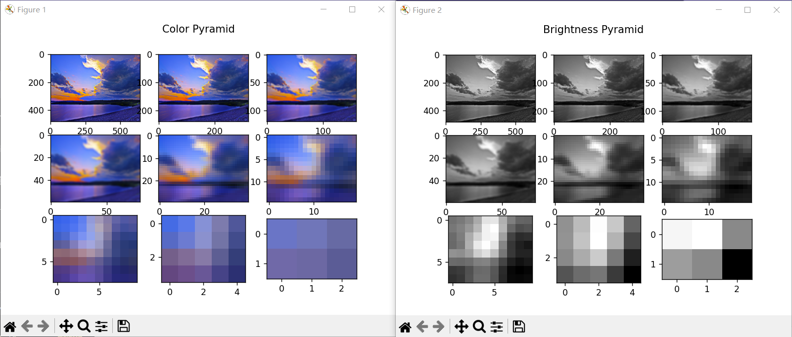

# 显著性检测 - ITTI算法

ITTI算法是一种用于图像处理和计算机视觉中的视觉显著性检测算法，其全称为“Information Theory-based Visual Attention Model”。该算法基于人类视觉注意机制的研究，通过计算图像中各个位置的显著性分值，来确定哪些区域是人类视觉关注的重点。

ITTI算法将图像分解为不同的尺度空间，然后对每个尺度的图像进行特征提取和分析，包括颜色、亮度、对比度等。通过计算每个尺度空间内像素点的显著性分值，并将不同尺度的显著性分值进行合并，得到最终的视觉显著性图像。

ITTI算法在计算机视觉领域中应用广泛，可以用于图像检索、目标跟踪、视觉注意机制的研究等。

## 1. 基本原理

当输入一张图像时，ITTI算法的实现过程大致可以分为以下几个步骤：

1. 预处理：首先，将输入图像进行预处理，包括调整图像大小、计算图像的亮度分量、将RGB颜色空间转换为色度-亮度空间等。这些预处理过程的目的是为了将图像转换为可以方便地进行后续处理的形式。
2. 构建高斯金字塔：接着，将预处理后的图像进行多次下采样，生成一系列尺度不同的图像，形成高斯金字塔。高斯金字塔的每一层通过对前一层图像进行高斯滤波得到，保留了前一层的低频信息，同时去除了高频信息。
3. 计算特征图：对于每个尺度的图像，ITTI算法通过计算颜色特征图、亮度特征图和方向特征图来表示图像的颜色、亮度和方向特征。具体来说，颜色特征图是在色度空间下计算的，亮度特征图是在亮度空间下计算的，而方向特征图则是在不同方向上计算的。
4. 计算显著图：将每个特征图与相应的高斯金字塔层次上的特征图进行归一化操作，并将归一化后的特征图相加得到相应的显著图。最后，将不同尺度的显著图通过加权平均的方法合并起来，得到最终的视觉显著图。

总的来说，ITTI算法通过对图像进行多尺度分析，计算不同特征的显著图，并将其合并得到最终的视觉显著图。这个算法不需要对训练数据进行学习，而是基于计算机视觉和神经科学的知识设计实现。

## 2. OpenCV 函数介绍

### 2.1 cv2.pyrDown() 函数

- **函数作用**

  `cv2.pyrDown()` 函数用于对输入图像进行高斯金字塔下采样操作，即对图像进行降采样，同时对图像进行高斯模糊以消除降采样的混叠效应。该函数返回下采样后的图像，用于生成图像金字塔中的不同层次图像。

- **语法格式**

  ```python
  dst = cv2.pyrDown(src[, dst[, dstsize[, borderType]]])
  ```

- **参数说明**

  | 参数名称   | 参数类型      | 参数描述                                                     |
  | :--------- | :------------ | :----------------------------------------------------------- |
  | src        | ndarray       | 输入图像深度，np.uint8, np.float32, np.float64 等            |
  | dst        | ndarray, 可选 | 输出图像深度，与输入图像深度相同                             |
  | dstsize    | tuple, 可选   | 输出图像尺寸，指定 dstsize 参数时生效，否则输出图像尺寸为输入图像尺寸的一半 |
  | borderType | int, 可选     | 边界处理方式，默认为 cv2.BORDER_DEFAULT                      |

### 2.2 cv2.subtract() 函数

- **函数作用**

  cv2.subtract函数是OpenCV库中用于求差的函数之一，用于计算两个数组或图像之间的差值。

- **语法格式**

  ```python
  dst = cv2.subtract(src1, src2[, dst[, mask[, dtype]]])
  ```

- **参数说明**

  | 参数  | 属性值                | 作用                                                       |
  | :---- | :-------------------- | :--------------------------------------------------------- |
  | src1  | numpy数组或图像       | 第一个输入数组或图像。                                     |
  | src2  | numpy数组或图像       | 第二个输入数组或图像，大小和类型应与第一个数组或图像相同。 |
  | dst   | numpy数组或图像，可选 | 输出数组或图像，与输入数组或图像具有相同的大小和类型。     |
  | mask  | numpy数组，可选       | 操作掩码，指定在进行计算时哪些元素需要处理。               |
  | dtype | numpy类型，可选       | 输出数据类型，必须为CV_8U、CV_16U、CV_32F或CV_64F。        |

- 注意：

  - `src1`和`src2`必须具有相同的大小和类型。
  - 如果指定了`dst`，则必须具有与输入数组或图像相同的大小和类型。
  - 如果指定了`mask`，则只有掩码值为非零的像素才会被处理。
  - 输出的数据类型由`dtype`指定，默认情况下，数据类型与`src1`相同。
  - 如果进行的是两个浮点数数组之间的操作，则结果可能包含负数。在这种情况下，可以使用`cv2.convertScaleAbs`函数将其转换为无符号整数类型。

## 3. 代码实现 [ITTITest.py](ITTITest.py)

完整的代码我并没有实现，因为：

1. 颜色金字塔一晚上没构建出来
2. PPT后面看不懂了

目前代码如下所示：

```python
import cv2
import matplotlib.pyplot as plt
import numpy as np


def readImg(path):
    # 读取图片
    img = cv2.imread(path)
    img_cv = cv2.cvtColor(img, cv2.COLOR_BGR2RGB)

    # 调整图片大小
    resized_img = cv2.resize(img_cv, (640, 480))
    return resized_img


# 构建高斯金字塔
def build_gaussian_pyramid(image, levels):
    # 构建空元组来存储高斯金字塔图像
    pyramid = ()

    # 首先将输入图像放入金字塔元组中
    pyramid += (image,)

    # 对输入图像进行高斯滤波和下采样，生成金字塔图像
    for i in range(levels - 1):
        # 进行高斯滤波
        blur = cv2.GaussianBlur(pyramid[i], (3, 3), 0)
        # 进行下采样
        downsample = cv2.pyrDown(blur)
        # 将结果加入金字塔元组中
        pyramid += (downsample,)

    return pyramid


# 构建亮度高斯金字塔
def build_intensity_gaussian_pyramid(image, levels):
    # 将彩色图像转换为灰度图像
    gray = cv2.cvtColor(image, cv2.COLOR_RGB2GRAY)

    # 构建空元组来存储高斯金字塔图像
    pyramid = ()

    # 首先将灰度图像放入金字塔元组中
    pyramid += (gray,)

    # 对灰度图像进行高斯滤波和下采样，生成金字塔图像
    for i in range(levels - 1):
        # 进行高斯滤波
        blur = cv2.GaussianBlur(pyramid[i], (3, 3), 0)
        # 进行下采样
        downsample = cv2.pyrDown(blur)
        # 将结果加入金字塔元组中
        pyramid += (downsample,)

    return pyramid


# 构建颜色高斯金字塔
def build_color_gaussian_pyramid(image, levels):
    # 构建空元组来存储颜色高斯金字塔图像

    pyramid = ()

    # 对输入图像进行通道分离，生成 BGR 三个颜色通道的图像
    b, g, r = cv2.split(image)

    # 首先将红色特征放入金字塔元组中
    red_feature = r - (g + b) / 2
    pyramid += (red_feature,)

    # 然后将绿色特征放入金字塔元组中
    green_feature = g - (r + b) / 2
    pyramid += (green_feature,)

    # 接着将蓝色特征放入金字塔元组中
    blue_feature = b - (r + g) / 2
    pyramid += (blue_feature,)

    # 最后将黄色特征放入金字塔元组中
    yellow_feature = (r + g) / 2 - np.abs(r - g) / 2 - b
    pyramid += (yellow_feature,)

    # 对每个特征图像进行高斯滤波和下采样，生成颜色高斯金字塔图像
    for i in range(3):
        for j in range(3):
            # 进行高斯滤波
            for k in range(4):
                pyramid_level = cv2.GaussianBlur(pyramid[k * 4 + i * 3 + j], (3, 3), 0)
                pyramid = pyramid[:k * 4 + i * 3 + j] + (pyramid_level,) + pyramid[k * 4 + i * 3 + j + 1:]

    return pyramid[4:]  # 返回红、绿、蓝、黄四个特征图像


def main():
    img = readImg(PATH)
    pyramid = build_gaussian_pyramid(img, 9)
    brightness_pyramid = build_intensity_gaussian_pyramid(img, 9)
    red_color_pyramid = build_color_gaussian_pyramid(img, 9)[0]

    # 显示 pyramid
    fig, axs = plt.subplots(3, 3)
    fig.suptitle('Color Pyramid')
    for i in range(3):
        for j in range(3):
            axs[i, j].imshow(pyramid[i * 3 + j])
    # plt.show()

    # 显示 brightness_pyramid
    fig_brightness, axs_brightness = plt.subplots(3, 3)
    fig_brightness.suptitle('Brightness Pyramid')
    for i in range(3):
        for j in range(3):
            axs_brightness[i, j].imshow(brightness_pyramid[i * 3 + j], cmap='gray')
    # plt.show()

    # 显示 red_color_pyramid
    fig_red, axs_red = plt.subplots(3, 3)
    fig_red.suptitle('Red Color Pyramid')
    for i in range(3):
        for j in range(3):
            axs_red[i, j].imshow(red_color_pyramid[i * 3 + j], cmap='gray')
    plt.show()


if __name__ == '__main__':
    PATH = "../../../img/scenery1.png"
    main()

```

## 4. 运行

### 4.1 测试用例


### 4.2 输出结果

