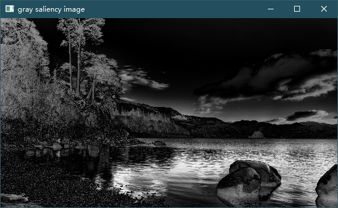

# 显著性检测 - LC算法

LC算法由Yun 和Mubarak 在2006年的视频显著性检测中提出。

该算法的设计考虑了图像像素数目的线性计算复杂性。图像的显著性映射建立在图像
像素之间的灰度对比度上。即为该像素与图中所有像素在灰度值上的距离之和作为该
像素的显著性值。

LC算法的基本思想是：计算某个像素在整个图像上的全局对比度，即该像素与图像中
其他所有像素在颜色上的距离之和作为该像素的显著值。

## 1. 算法思路

LC算法的基本思想是计算某个像素在整个图像上的全局对比度，即该像素与图像中其他所有像素在颜色上的距离之和作为该像素的显著值。具体而言，该算法通过以下步骤来计算显著性图：

1. 对图像进行颜色空间转换，例如将RGB颜色空间转换为Lab颜色空间。
2. 对于图像中的每个像素，计算该像素与整个图像中其他像素在颜色空间中的距离，例如使用欧几里得距离或者其他距离度量方法。
3. 将每个像素与其他像素的距离之和作为该像素的显著性值。
4. 根据计算得到的每个像素的显著性值，生成显著性图。

## 2. 算法优缺点

LC算法的优点是可以在处理大型图像时有效地减少计算复杂度，因为该算法的计算复杂度与图像的像素数量成线性关系。此外，该算法也具有以下优点：

- 算法简单，易于实现。
- 在处理一些简单的图像时，该算法可以产生较好的显著性图。

然而，由于该算法只考虑像素之间的颜色距离，因此在处理某些具有复杂纹理或结构的图像时可能会出现一些缺陷。此外，由于算法中涉及到所有像素之间的距离计算，因此算法的计算复杂度较高，不适合处理实时性要求较高的应用场景。

## 3. 代码实现 [saliency_detectionLC.py](saliency_detectionLC.py)

### 3.1 读取图片

判断窄边大小，将图片适当缩放，然后转换灰度图像返回

```python
def read_image(image_path):
    image = cv2.imread(image_path)
    min_edge = min(image.shape[0], image.shape[1])  # 图片窄边
    proportion = 1  # 缩放比例
    if min_edge > 3000:
        proportion = 0.1
    elif 2000 < min_edge <= 3000:
        proportion = 0.2
    elif 1000 < min_edge <= 2000:
        proportion = 0.3
    elif 700 <= min_edge <= 1000:
        proportion = 0.4
    resize_image = cv2.resize(image, None, fx=proportion, fy=proportion, interpolation=cv2.INTER_CUBIC)
    image_gray = cv2.cvtColor(resize_image, cv2.COLOR_BGR2GRAY)
    return image_gray
```

### 3.2 LC 局部对比度增强

- 首先定义一个函数LC，该函数输入为灰度图像，获取图像的高度和宽度，创建一个大小为`image_height*image_width`的全0矩阵`image_gray_copy`，准备存储输出的图像。

  ```python
  def LC(image_gray):
      image_height = image_gray.shape[0]
      image_width = image_gray.shape[1]
      image_gray_copy = np.zeros((image_height, image_width))
  ```

- 通过cv2中的`calcHist`函数，计算图像`image_gray`的直方图，其中[0]表示处理第0个通道的像素值（灰度图像只有1个通道），None表示不使用掩膜，[256]表示灰度级数，[0.0, 256.0]表示像素值的范围。

  ```python
      hist_array = cv2.calcHist([image_gray], [0], None, [256], [0.0, 256.0])  
      # 直方图，统计图像中每个灰度值的数量
  ```

- 调用`cal_dist`函数，将直方图`hist_array`转化为灰度值与其他值的距离。

  ```python
      gray_dist = cal_dist(hist_array)  # 灰度值与其他值的距离
  ```

- 遍历图像的所有像素，将输入图像中的每个像素的灰度值映射到输出图像中，具体方法是将每个像素值`temp`通过`gray_dist`映射到另一个灰度值，并将结果存储到输出图像`image_gray_copy`中。

  ```python
      for i in range(image_width):
          for j in range(image_height):
              temp = image_gray[j][i]
              image_gray_copy[j][i] = gray_dist[temp]
  ```

- 打印输出图像的信息，包括图像的灰度值矩阵、灰度值矩阵中最小值和最大值，并将输出图像的灰度值矩阵归一化到0到1之间。

  ```python
      print("image_gray_copy1:",image_gray_copy)
      print("np.min(image_gray_copy):",np.min(image_gray_copy))
      print("np.max(image_gray_copy):",np.max(image_gray_copy))
      image_gray_copy = (image_gray_copy - np.min(image_gray_copy)) / (np.max(image_gray_copy) - np.min(image_gray_copy))
      print("image_gray_copy2:",image_gray_copy)
  ```

- 返回结果

    ```python
        return image_gray_copy
    ```

### 3.3 呈现结果

```python
def plot(image):
    cv2.imshow("gray saliency image", image)
    cv2.waitKey(0)
```

## 4. 运行

### 4.1 测试用例


### 4.2 运行结果

