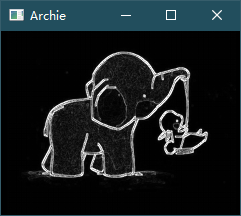

# 边缘检测

Sobel算子是一种经典的图像边缘检测算法，它是一种基于梯度的算子，用于在图像中检测水平和垂直方向的边缘。

## 1. 概述

Sobel算子的原理是基于图像中像素值的变化率来确定边缘位置。对于每个像素点，我们可以通过对其周围像素的梯度值进行计算，来判断该像素是否为边缘点。

在Sobel算子中，我们定义了两个核（kernel）矩阵，一个用于计算水平方向梯度，另一个用于计算垂直方向梯度。这两个核的形状都是3x3的矩阵，它们分别如下所示：

水平方向梯度核：

```
-1  0  1
-2  0  2
-1  0  1
```

垂直方向梯度核：

```
-1 -2 -1
 0  0  0
 1  2  1
```

对于图像中的每一个像素点，我们将对它周围3x3范围内的像素应用这两个核，计算出水平方向梯度值和垂直方向梯度值，然后将这两个值进行合并，计算出该像素点的梯度幅值，作为该点的边缘强度。

Sobel算子常常被用来检测图像中的边缘和轮廓，它可以通过调整权重系数和阈值等参数来控制边缘检测的精度和召回率。

## 2. OpenCV 库 - Sobel 算子函数

OpenCV 中提供给封装好的Sobel算子函数，不需要一一计算。

### 2.1 构造函数

```python
cv2.Sobel(src,ddepth,dx,dy,ksize)
```

### 2.2 参数解释

| 参数名 | 含义 / 作用                                                  |
| ------ | :----------------------------------------------------------- |
| src    | 原图                                                         |
| ddepth | 处理结果图像深度，一般都填`-1`，即与原图深度相同。这里需要填写`cv2.CV_64F`。简单来说就是如果填写`-1`，在计算梯度时产生的负数就会被程序默认为`0`，导致有一边的边缘出不来。而`cv2.CV_64F`范围更大，可以保留负数。 |
| dx     | 计算`x`方向的梯度                                            |
| dy     | 计算`y`方向的梯度                                            |
| ksize  | 卷积核的尺寸。默认为`3`，即`3*3`的矩阵                       |

### 2.3 示例

Sobel函数如果想要计算X方向的梯度：

```python
cv2.Sobel(src,ddepth,1,0,ksize)
```

反之，计算Y方向的梯度

```python
cv2.Sobel(src,ddepth,0,1,ksize)
```

> 当然，想要计算总梯度直接`dx=1`，`dy=1`也是可以的，但是效果十分不好。不建议使用这种方法。
>
> 通常使用的方法是按权相加法。按权相加x方向梯度和y方向梯度。

使用`cv2.addWeight()`函数，该函数支持5个参数：

| 参数名  | 含义 / 作用                                     |
| :------ | ----------------------------------------------- |
| src1    | 第一幅图像                                      |
| weight1 | 第一幅图像的权重                                |
| src2    | 第二幅图像                                      |
| weight2 | 第二幅图像的权重                                |
| 偏置值  | 表示两幅图像加权和的常数值，通常情况下，该值为0 |

这里给出一个使用示例：

```python
import cv2

# 读取两幅图像
img1 = cv2.imread('image1.jpg')
img2 = cv2.imread('image2.jpg')

# 按权相加计算图像梯度
dx = cv2.Sobel(img1, cv2.CV_64F, 1, 0) + cv2.Sobel(img2, cv2.CV_64F, 1, 0)
dy = cv2.Sobel(img1, cv2.CV_64F, 0, 1) + cv2.Sobel(img2, cv2.CV_64F, 0, 1)

# 按权相加合并梯度
dst = cv2.addWeighted(dx, 0.5, dy, 0.5, 0)

# 显示结果
cv2.imshow('result', dst)
cv2.waitKey(0)
cv2.destroyAllWindows()
```

在分别计算完X、Y方向的权值时，里面是有负数的。需要对这些负数取绝对值，否则会被归为0

取绝对值的函数是`cv2.convertScaleAbs(img)`

## 3. 代码实现 [Sobel.py](Sobel.py)

### 3.1 算法流程

1. 通过`cv2.imread()`函数读取了一张名为`"../../img/elephant.png"`的图像，并将其转换为灰度图像。读取到的图像存储在变量`img`中。
2. 使用`cv2.Sobel()`函数计算了`img`图像在`x`方向和`y`方向的梯度（即边缘），分别存储在变量`mask_x`和`mask_y`中。
3. 使用`cv2.convertScaleAbs()`函数将`mask_x`和`mask_y`中的梯度值转换为无符号整数类型的像素值，并将结果存储在`img_x`和`img_y`中。
4. 使用`cv2.addWeighted()`函数将`img_x`和`img_y`中的结果按照权值`0.5`相加，得到最终的边缘图像，存储在变量`mask`中。
5. 使用`cv2.resize()`函数将`mask`图像缩小一半，存储在变量`Archie`中。
6. 使用`cv2.imshow()`函数将`Archie`图像显示在窗口中，使用`cv2.waitKey()`等待用户按下任意键。
7. 最后使用`cv2.destroyAllWindows()`函数销毁所有的窗口。

### 3.2 测试用例


### 3.3 测试结果

